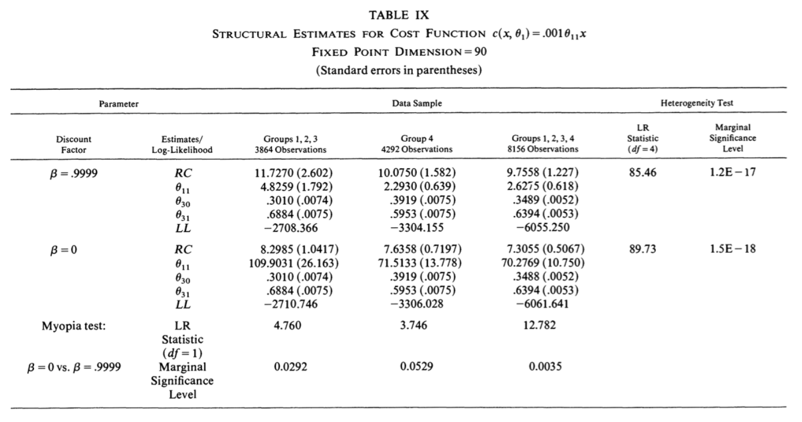
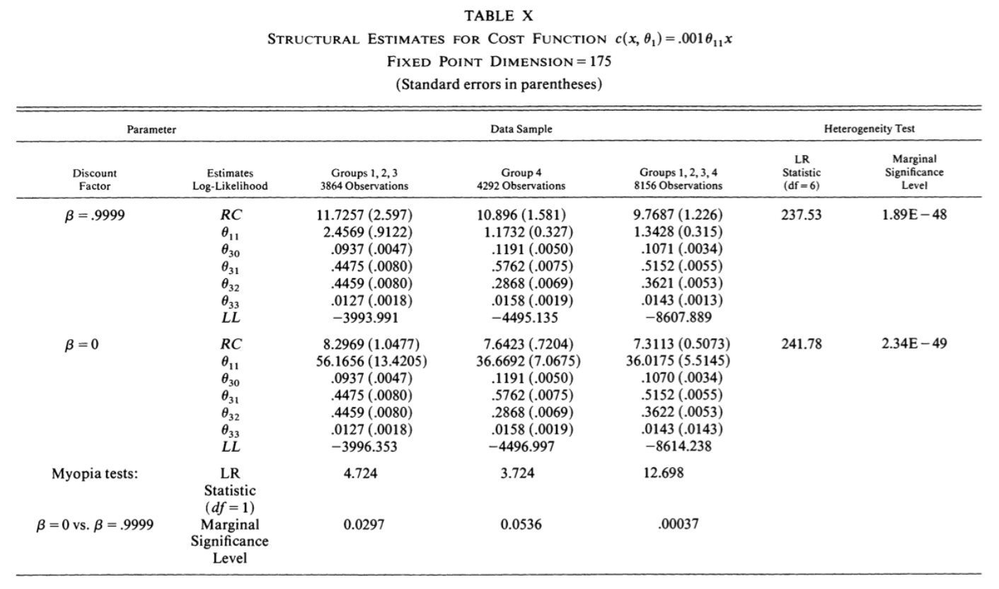

# Zurcher.jl

Documentation : [](https://floswald.github.io/Zurcher.jl/dev)

GitHub Actions : [](https://github.com/floswald/Zurcher.jl/actions?query=workflow%3ACI+branch%3Amain)

* This is a teaching-oriented package for the Bus Engine Replacement Model after Rust (1987) used for my [Computational Econ Course](https://floswald.github.io/NumericalMethods/)
* We implement both _naive_ nfxp and mpec estimation. It is _naive_ nfxp because it uses standard VFI instead of the much more performant polyalgorithm developed by Rust in his paper. For a thorough benchmarking exercise I refer to 
    1. ECTA Comment by [Fedor Iskhakov, Jinhyuk Lee, John Rust, Bertel Schjerning, Kyoungwon Seo](https://www.econometricsociety.org/publications/econometrica/2016/01/01/comment-“constrained-optimization-approaches-estimation)
    1. Matlab implementation which includes the polyalgorithm and analytic derivatives for likelihood function distributed as part of the [DSE2019](https://github.com/dseconf/DSE2019/tree/master/02_DDC_SchjerningIskhakov/code/zurcher) summer school. Several parts of my code have been copied and modified from that code base.

### What is the point of this package?

* The main point is to demonstrate the relative easiness with which we can tackle an MPEC problem with the [`JuMP.jl`](https://jump.dev) package.
* JuMP is like AMPL, but for free and embedded in a proper programming language. 
* For a similar demonstration of this please visit [https://github.com/UBCECON567/BLPDemand.jl](https://github.com/UBCECON567/BLPDemand.jl), which is very cool.

## How To Install

1. [Download julia](https://julialang.org/downloads/)
2. start julia. you see this:
    ```
                   _
       _       _ _(_)_     |  Documentation: https://docs.julialang.org
      (_)     | (_) (_)    |
       _ _   _| |_  __ _   |  Type "?" for help, "]?" for Pkg help.
      | | | | | | |/ _` |  |
      | | |_| | | | (_| |  |  Version 1.6.0 (2021-03-24)
     _/ |\__'_|_|_|\__'_|  |  Official https://julialang.org/ release
    |__/                   |
    ```
3. Hit the `]` key to switch to package manager mode. the prompt switches to 
    ```
    (v1.6) pkg>
    ```
4. Download this package by pasting this into the `(v1.6) pkg>` prompt and hitting enter. 
    ```julia
    dev https://github.com/floswald/Zurcher.jl
    ```
5. After this is done, hit backspace or `ctrl-c` to go back to standard `julia>` prompt.
    ```julia
    julia> cd(joinpath(DEPOT_PATH[1],"dev","Zurcher"))  # go to the location of Zurcher
    ```
6. Go back to package mode: type `]`. then:
    ```julia
    (v1.6) pkg> activate .     # tell pkg manager to modify current directory
    (Zurcher) pkg> instantiate    # download all dependencies
    ```
7. Done! :tada: Now try it out


## Trying Out

There are two main functions `nfxp` and `mpec` which will run either estimation strategy. Try this first

```julia
julia> using Zurcher

julia> Zurcher.nfxp(is_silent = true)
(RC = 7.829239792379837, θc = 4.632167451403739)

julia> Zurcher.mpec(is_silent = true)
(RC = 7.829239917004901, θc = 4.632167887519505)
```

## How do the JuMP (MPEC) and NFXP implementations differ?

I can point to at least 2 things:

1. There is a slight sublety in how function `make_trans` builds the transition matrix for the nfxp case: it creates the vector or probabilities for the rows as `p = [θ ; 1 - sum(θ)]`, i.e. it adds a safety element in last position to make sure that whatever the solver chooses in terms of θ will be a proper probability distribution. I try to replicate that in the MPEC formulation, but it is not exactly equivalent. 
2. I was not able to implement the centering of values in the MPEC approach because I am not allowed to write something like
    ```
    @variable(m, M)
    @constraint(m, M == maximum(V))
    ```

Of course the remaining option is that there is a mistake.

## All Results

### Accuracy

You can run a set of results with the function `runall` which will return a dict with results and timings for different values of β and `n`. In general, the partial MLE results are ok for both methods, but MPEC never converges to the correct solution with very high values for β. Full MLE converges to a different optimum in MPEC because of the way I try to implement the _last bin issue_ mentioned above. This can very likely be improved.

### Timing

* The MPEC solution is always orders of magnitude faster than the NFXP.
* As mentioned above, this is not a general statement, because in this class of model the NFXP can be massively sped up by implementing Rust's polyalgorithm. 

```julia
julia> d = Zurcher.runall()
```

For example, 

```julia
julia> d["n=90"]["β=0.999"][:nfxp_full]
Dict{Symbol, Any} with 2 entries:
  :res  => (RC = 9.7051, θc = 2.67984, θp = [0.348995, 0.639116])
  :time => 54.181
```

this comes quite close to table 9 of Rust (column 5). The setting in the table with β=0.9999 takes too long to run, so only approximate.




For the larger state space, table X in Rust, only the NFXP solution converges for the full MLE. MPEC gets close at β=0.99 but fails to converge for higher values. The setting in the table with β=0.9999 takes too long to run, so the solution is not the same (column 5).




```julia
julia> d["n=175"]["β=0.999"][:nfxp_full]
Dict{Symbol, Any} with 2 entries:
  :res  => (RC = 9.71799, θc = 1.36965, θp = [0.10693, 0.515465, 0.362037, 0.0143426, 0.000858029])
  :time => 402.414
```

Here are all results:

```julia
julia> d["n=90"]["β=0.99"]
Dict{Any, Any} with 4 entries:
  :nfxp      => Dict{Symbol, Any}(:res=>(RC = 9.27126, θc = 3.21522), :time=>2.23572)
  :mpec      => Dict{Symbol, Any}(:res=>(RC = 9.27126, θc = 3.21522), :time=>0.135772)
  :mpec_full => Dict{Symbol, Any}(:res=>(RC = 8.79722, θc = 2.89127, θp = [0.34908, 0.639006, 0.0119135]), :time=>0.347827)
  :nfxp_full => Dict{Symbol, Any}(:res=>(RC = 9.27117, θc = 3.21538, θp = [0.348981, 0.639128]), :time=>7.04272)

julia> d["n=90"]["β=0.995"]
Dict{Any, Any} with 4 entries:
  :nfxp      => Dict{Symbol, Any}(:res=>(RC = 9.49706, θc = 2.91503), :time=>4.09659)
  :mpec      => Dict{Symbol, Any}(:res=>(RC = 9.49705, θc = 2.91502), :time=>0.13477)
  :mpec_full => Dict{Symbol, Any}(:res=>(RC = 8.13258, θc = 2.0859, θp = [0.349273, 0.638827, 0.0119004]), :time=>0.339474)
  :nfxp_full => Dict{Symbol, Any}(:res=>(RC = 9.49694, θc = 2.91518, θp = [0.348988, 0.639121]), :time=>11.2313)

julia> d["n=90"]["β=0.999"]
Dict{Any, Any} with 4 entries:
  :nfxp      => Dict{Symbol, Any}(:res=>(RC = 9.70523, θc = 2.67968), :time=>20.7043)
  :mpec      => Dict{Symbol, Any}(:res=>(RC = 6.52339, θc = 0.944421), :time=>0.139025)
  :mpec_full => Dict{Symbol, Any}(:res=>(RC = 5.76958, θc = 0.543109, θp = [0.349667, 0.638459, 0.0118736]), :time=>0.24028)
  :nfxp_full => Dict{Symbol, Any}(:res=>(RC = 9.7051, θc = 2.67984, θp = [0.348995, 0.639116]), :time=>56.6185)

julia> d["n=175"]["β=0.99"]
Dict{Any, Any} with 4 entries:
  :nfxp      => Dict{Symbol, Any}(:res=>(RC = 9.28226, θc = 1.64404), :time=>4.88497)
  :mpec      => Dict{Symbol, Any}(:res=>(RC = 9.28226, θc = 1.64404), :time=>0.170268)
  :mpec_full => Dict{Symbol, Any}(:res=>(RC = 5.13849, θc = 0.77846, θp = [0.0743879, 0.446249, 0.416163, 0.0246749, 0.00295022, 0.0355752]), :time=>38.…
  :nfxp_full => Dict{Symbol, Any}(:res=>(RC = 9.28236, θc = 1.64394, θp = [0.106926, 0.51546, 0.362044, 0.0143433, 0.000858095]), :time=>51.7586)

julia> d["n=175"]["β=0.995"]
Dict{Any, Any} with 4 entries:
  :nfxp      => Dict{Symbol, Any}(:res=>(RC = 9.50888, θc = 1.49028), :time=>11.727)
  :mpec      => Dict{Symbol, Any}(:res=>(RC = 9.50892, θc = 1.49029), :time=>0.226373)
  :mpec_full => Dict{Symbol, Any}(:res=>(RC = 7.64161, θc = 0.908708, θp = [0.107058, 0.515525, 0.361783, 0.0143501, 0.000886562, 0.000397098]), :time=>…
  :nfxp_full => Dict{Symbol, Any}(:res=>(RC = 9.50907, θc = 1.49019, θp = [0.106928, 0.515463, 0.36204, 0.0143429, 0.000858059]), :time=>117.805)

julia> d["n=175"]["β=0.999"]
Dict{Any, Any} with 4 entries:
  :nfxp      => Dict{Symbol, Any}(:res=>(RC = 9.7178, θc = 1.36977), :time=>62.5056)
  :mpec      => Dict{Symbol, Any}(:res=>(RC = 6.53308, θc = 0.483032), :time=>0.213384)
  :mpec_full => Dict{Symbol, Any}(:res=>(RC = 4.9592, θc = 0.0230143, θp = [0.107947, 0.5164, 0.360075, 0.0142959, 0.000885655, 0.000396517]), :time=>14…
  :nfxp_full => Dict{Symbol, Any}(:res=>(RC = 9.71799, θc = 1.36965, θp = [0.10693, 0.515465, 0.362037, 0.0143426, 0.000858029]), :time=>432.629)
```

